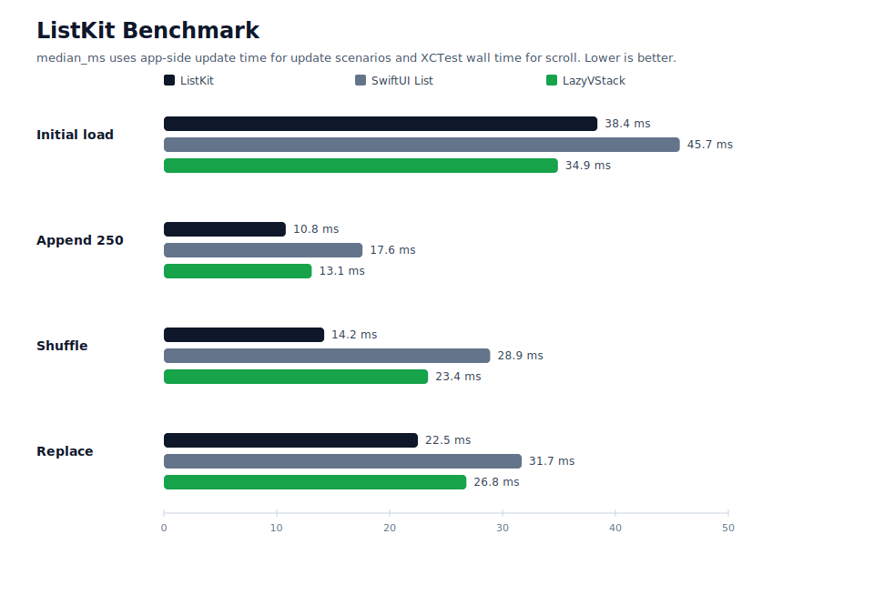

# ListKit

[English](./README.md) | [한국어](./README.ko.md)

`ListKit`은 SwiftUI 문법으로 선언하면서 내부는 `UICollectionView`로 렌더링하는 리스트 라이브러리입니다.

목표는 SwiftUI다운 리스트 작성 경험을 유지하면서도, SwiftUI `List`가 직접 노출하지 않는 collection view delegate 생명주기와 업데이트 전략을 선택적으로 사용할 수 있게 하는 것입니다.

## 목차

- [빠른 시작](#빠른-시작)
- [현재 상태](#현재-상태)
- [요구 사항](#요구-사항)
- [테스트](#테스트)
- [SwiftUI List와의 차이](#swiftui-list와의-차이)
- [주요 API](#주요-api)
- [Identity와 Equality](#identity와-equality)
- [Update Engine](#update-engine)
- [Refresh와 Search](#refresh와-search)
- [Context Menu](#context-menu)
- [성능 디버깅](#성능-디버깅)
- [벤치마크](#벤치마크)
- [SwiftUI List에서 이전하기](#swiftui-list에서-이전하기)
- [샘플 앱 예제](#샘플-앱-예제)

## 빠른 시작

첫 예제는 [BasicListExample](./Examples/SampleApp/SampleApp/View/BasicListExample.swift)과 같은 흐름입니다.

```swift
import SwiftUI
import ListKit

struct Message: Identifiable, Hashable {
    let id: Int
    var title: String
    var subtitle: String
}

struct MessageRow: View {
    let message: Message

    var body: some View {
        VStack(alignment: .leading, spacing: 4) {
            Text(message.title)
                .font(.headline)
            Text(message.subtitle)
                .font(.subheadline)
                .foregroundStyle(.secondary)
        }
        .padding(.vertical, 8)
    }
}

struct InboxView: View {
    let messages: [Message]

    var body: some View {
        LKList(messages, id: \.id) { message in
            MessageRow(message: message)
        }
        .listKitStyle(.plain)
        .onSelect { context in
            print("Selected", context.id)
        }
        .refreshable {
            await reload()
        }
        .updateEngine(.diffableDataSource)
    }

    private func reload() async {}
}
```

미리보기 가능한 예제는 [Examples/ListKitExamples](./Examples/ListKitExamples/ListKitExamples.swift)에 있고, 실행 가능한 샘플 앱은 [Examples/SampleApp](./Examples/SampleApp)에 있습니다. 샘플 앱의 각 화면은 [Examples/SampleApp/SampleApp/View](./Examples/SampleApp/SampleApp/View)에 파일별로 분리되어 있습니다.

## 현재 상태

구현 진행 상황은 [AGENTS.md](./AGENTS.md)에 기록되어 있습니다. 현재 milestone은 Swift Package 기반 라이브러리, public `LK` namespace, UIKit bridge, 주요 delegate hook, update engine 예제를 포함합니다.

## 요구 사항

- Swift 6.3
- iOS 16.0+
- Swift Package Manager
- `.differenceKit` update engine을 위해 DifferenceKit 1.3.0을 직접 의존성으로 사용합니다.

## 테스트

```sh
swift test
```

UIKit 동작은 iOS 시뮬레이터 테스트로 확인합니다.

```sh
xcodebuild test -scheme ListKit -destination 'platform=iOS Simulator,name=iPhone 17,OS=26.4'
```

샘플 앱 빌드는 다음 명령으로 확인할 수 있습니다.

```sh
xcodebuild -project Examples/SampleApp/SampleApp.xcodeproj -scheme SampleApp -destination 'generic/platform=iOS Simulator' build
```

## SwiftUI List와의 차이

`ListKit`은 SwiftUI 선언 방식을 유지하지만 렌더링은 `UICollectionView`를 사용합니다.

| 영역 | SwiftUI `List` | `ListKit` |
| --- | --- | --- |
| Row content | SwiftUI `View` | collection view cell에 hosted된 SwiftUI `View` |
| Delegate lifecycle | 대부분 숨겨짐 | selection, highlight, display, scroll, prefetch, context menu, focus 등 노출 |
| Update strategy | 시스템이 제어 | `.reloadData`, `.diffableDataSource`, `.differenceKit` 선택 |
| Layout | SwiftUI list style | compositional layout 기반 list/grid |
| UIKit escape hatch | 제한적 | 필요한 경우 UIKit 타입 기반 advanced hook 제공 |

기본 시스템 동작만 필요하면 SwiftUI `List`가 더 단순합니다. collection view delegate timing, update engine 선택, collection layout 제어가 필요하면 `ListKit`을 사용합니다.

## 주요 API

일반적인 UIKit delegate surface는 SwiftUI modifier로 제공합니다.

| 기능 | ListKit API |
| --- | --- |
| 선택 | `.onShouldSelect`, `.onSelect`, `.selection`, `.selectionMode` |
| 하이라이트 | `.onShouldHighlight`, `.onHighlight`, `.onUnhighlight` |
| 표시 생명주기 | `.onWillDisplay`, `.onDidEndDisplaying` |
| supplementary 표시 생명주기 | `.onWillDisplayHeader`, `.onDidEndDisplayingHeader`, `.onWillDisplayFooter`, `.onDidEndDisplayingFooter` |
| prefetch | `.onPrefetch`, `.onCancelPrefetch` |
| primary action | `.onCanPerformPrimaryAction`, `.onPrimaryAction` |
| context menu advanced hook | `.uiContextMenuConfiguration`, `.onPreviewCommit`, `.previewForHighlightingContextMenu`, `.previewForDismissingContextMenu` |
| scroll | `.onScroll`, `.onWillBeginDragging`, `.onDidEndDragging`, `.onReachEnd` |

row-level handler가 section-level handler보다 우선하고, section-level handler가 list-level handler보다 우선합니다.

## Identity와 Equality

모든 section과 row는 stable identity가 필요합니다.

```swift
LKList(messages, id: \.id) { message in
    MessageRow(message: message)
}
```

builder DSL에서는 `LKSection(id:)`, `LKRow(_:id:)`로 identity를 제공합니다.

```swift
LKList {
    LKSection(id: "inbox") {
        for message in messages {
            LKRow(message, id: \.id) {
                MessageRow(message: message)
            }
            .equatableToken(message.updatedAt)
        }
    }
}
```

identity는 “같은 항목인가”를 판단하고, equality token은 “렌더링 내용이 바뀌었는가”를 판단합니다. SwiftUI view 값 자체는 비교하지 않습니다.

## Update Engine

리스트별로 업데이트 엔진을 고를 수 있습니다.

```swift
LKList(messages, id: \.id) { message in
    MessageRow(message: message)
}
.updateEngine(.diffableDataSource)
```

| Engine | 사용 시점 | 참고 |
| --- | --- | --- |
| `.reloadData` | 디버깅, 단순한 동작, 애니메이션이 중요하지 않은 화면 | 가장 단순하지만 세밀한 animation은 없습니다. |
| `.diffableDataSource` | Apple-native diffing이 필요한 일반적인 화면 | stable section/item ID와 잘 맞습니다. |
| `.differenceKit` | staged changeset과 explicit content equality가 필요한 화면 | DifferenceKit 의존성이 필요합니다. |

diff 경로가 안전하게 업데이트를 적용할 수 없으면 ListKit은 더 안전한 reload 경로로 fallback할 수 있습니다.

## Refresh와 Search

ListKit은 collection view 기반 refresh control을 제공합니다.

```swift
LKList(messages, id: \.id) { message in
    MessageRow(message: message)
}
.refreshable {
    await reload()
}
```

검색은 SwiftUI `.searchable`과 조합합니다.

```swift
@State private var query = ""

LKList(filteredMessages, id: \.id) { message in
    MessageRow(message: message)
}
.searchable(text: $query)
```

필터링은 view model이나 computed state에서 처리한 뒤 필터링된 collection을 `LKList`에 전달합니다.

## Context Menu

단순 메뉴는 row content 안에서 SwiftUI `.contextMenu`를 그대로 사용합니다.

```swift
LKList(messages, id: \.id) { message in
    MessageRow(message: message)
        .contextMenu {
            Button("Archive") {
                archive(message.id)
            }
        }
}
```

UIKit preview controller, targeted preview, commit animator가 필요하면 ListKit의 advanced context menu hook을 사용합니다.

## 성능 디버깅

- stable ID를 사용하세요. ID가 바뀌면 in-place update가 아니라 remove/insert로 처리됩니다.
- content나 size가 바뀌는 상태에는 `.equatableToken(...)`을 붙이세요.
- 이미지/비디오 작업은 `.onWillDisplay`에서 시작하고 `.onDidEndDisplaying`에서 정리하세요.
- 대부분의 animated update는 `.diffableDataSource`가 기본 선택지입니다.
- diffing 문제를 분리하려면 `.reloadData`로 바꿔 확인하세요.
- invalid lookup, unsupported layout, diff fallback을 추적할 때는 `.listKitDiagnostics(.enabled)`를 켜세요.

## 벤치마크

[Examples/BenchmarkApp](./Examples/BenchmarkApp) 벤치마크 프로젝트는 같은 row model을 `ListKit`, SwiftUI `List`, `ScrollView + LazyVStack`으로 렌더링해서 비교합니다.



현재 저장소에 포함된 그래프는 [Benchmarks/results/sample-results.csv](./Benchmarks/results/sample-results.csv)에서 생성한 샘플 데이터입니다. 문서와 그래프 생성 흐름을 보여주기 위한 값이며, 공식 성능 수치로 보지 않아야 합니다.

벤치마크 앱 빌드:

```sh
xcodebuild \
  -project Examples/BenchmarkApp/BenchmarkApp.xcodeproj \
  -scheme BenchmarkApp \
  -destination 'generic/platform=iOS Simulator' \
  build
```

의미 있는 수치를 얻으려면 같은 물리 기기에서 Release build로 실행하고, row count와 scenario를 고정한 뒤 각 구현을 여러 번 측정해서 median 값을 기록하세요. CSV를 실제 측정값으로 교체한 뒤 그래프를 다시 생성합니다.

```sh
python3 Benchmarks/scripts/render_chart.py \
  Benchmarks/results/sample-results.csv \
  Benchmarks/results/listkit-benchmark-sample.svg
```

자세한 흐름은 [Benchmarks/README.md](./Benchmarks/README.md)에 정리되어 있습니다.

## SwiftUI List에서 이전하기

기존 SwiftUI `List`:

```swift
List(messages) { message in
    MessageRow(message: message)
}
```

ListKit:

```swift
LKList(messages, id: \.id) { message in
    MessageRow(message: message)
}
```

| SwiftUI List 개념 | ListKit 대응 |
| --- | --- |
| `List(data) { row }` | `LKList(data, id: \.id) { row }` |
| `Section` | `LKSection(id:)`와 header/footer builder |
| `.refreshable` | `LKList`의 `.refreshable` |
| `.searchable` | SwiftUI `.searchable`을 `LKList`에 조합 |
| `.onDelete`, `.onMove` | source data를 변경하고 update engine이 새 model을 반영 |
| row `.contextMenu` | row content 안에 SwiftUI `.contextMenu` 유지 |
| UIKit context menu preview | ListKit advanced context menu hook 사용 |
| list style | `.listKitStyle(...)` 또는 section `.sectionLayout(...)` |

기본 migration이 컴파일되면 화면 요구에 맞춰 update engine, selection binding, delegate hook을 하나씩 추가하세요.

## 샘플 앱 예제

샘플 앱은 ListKit의 주요 동작을 화면별로 확인할 수 있는 작은 갤러리입니다.

| 화면 | 파일 | 설명 |
| --- | --- | --- |
| Basic List | [BasicListExample.swift](./Examples/SampleApp/SampleApp/View/BasicListExample.swift) | plain 리스트, 선택, display lifecycle, pull to refresh, diffable update engine을 함께 보여줍니다. |
| Sections | [SectionedHeaderFooterExample.swift](./Examples/SampleApp/SampleApp/View/SectionedHeaderFooterExample.swift) | builder DSL로 section, header, footer를 구성합니다. |
| Selection | [SelectionExample.swift](./Examples/SampleApp/SampleApp/View/SelectionExample.swift) | 다중 선택과 archived row 선택 차단 규칙을 보여줍니다. |
| Refresh | [RefreshExample.swift](./Examples/SampleApp/SampleApp/View/RefreshExample.swift) | `UIRefreshControl` 기반 refresh 후 새 row를 삽입합니다. |
| Search | [SearchExample.swift](./Examples/SampleApp/SampleApp/View/SearchExample.swift) | SwiftUI `.searchable`과 필터링된 `LKList` 조합을 보여줍니다. |
| Display Lifecycle | [DisplayLifecycleExample.swift](./Examples/SampleApp/SampleApp/View/DisplayLifecycleExample.swift) | `willDisplay`, `didEndDisplaying`으로 row 작업 시작/정지를 라우팅합니다. |
| Prefetch | [PrefetchExample.swift](./Examples/SampleApp/SampleApp/View/PrefetchExample.swift) | `onReachEnd`로 끝에 도달하기 전에 다음 페이지를 append하는 infinite scroll 예제입니다. |
| Image Prefetch | [ImagePrefetchExample.swift](./Examples/SampleApp/SampleApp/View/ImagePrefetchExample.swift) | `.onPrefetch`, `.onCancelPrefetch` collection view callback으로 이미지 로딩 캐시를 제어합니다. |
| Context Menu | [ContextMenuExample.swift](./Examples/SampleApp/SampleApp/View/ContextMenuExample.swift) | row content 안에서 SwiftUI context menu를 사용합니다. |
| Grid Layout | [GridLayoutExample.swift](./Examples/SampleApp/SampleApp/View/GridLayoutExample.swift) | section 단위 `.sectionLayout(.grid(...))` 레이아웃을 보여줍니다. |
| Diffable Engine | [DiffableEngineExample.swift](./Examples/SampleApp/SampleApp/View/DiffableEngineExample.swift) | Apple `UICollectionViewDiffableDataSource` 업데이트 엔진을 사용합니다. |
| DifferenceKit Engine | [DifferenceKitEngineExample.swift](./Examples/SampleApp/SampleApp/View/DifferenceKitEngineExample.swift) | DifferenceKit staged update 엔진을 사용합니다. |
| Shuffle Diffable | [ShuffleDiffableExample.swift](./Examples/SampleApp/SampleApp/View/ShuffleDiffableExample.swift) | 우측 상단 shuffle 버튼으로 diffable engine에서 row 이동을 확인합니다. |
| Shuffle DifferenceKit | [ShuffleDifferenceKitExample.swift](./Examples/SampleApp/SampleApp/View/ShuffleDifferenceKitExample.swift) | 우측 상단 shuffle 버튼으로 DifferenceKit engine에서 row 이동을 확인합니다. |
| Large Data | [LargeDataExample.swift](./Examples/SampleApp/SampleApp/View/LargeDataExample.swift) | 1,000개 row를 가진 큰 snapshot 업데이트를 확인합니다. |
