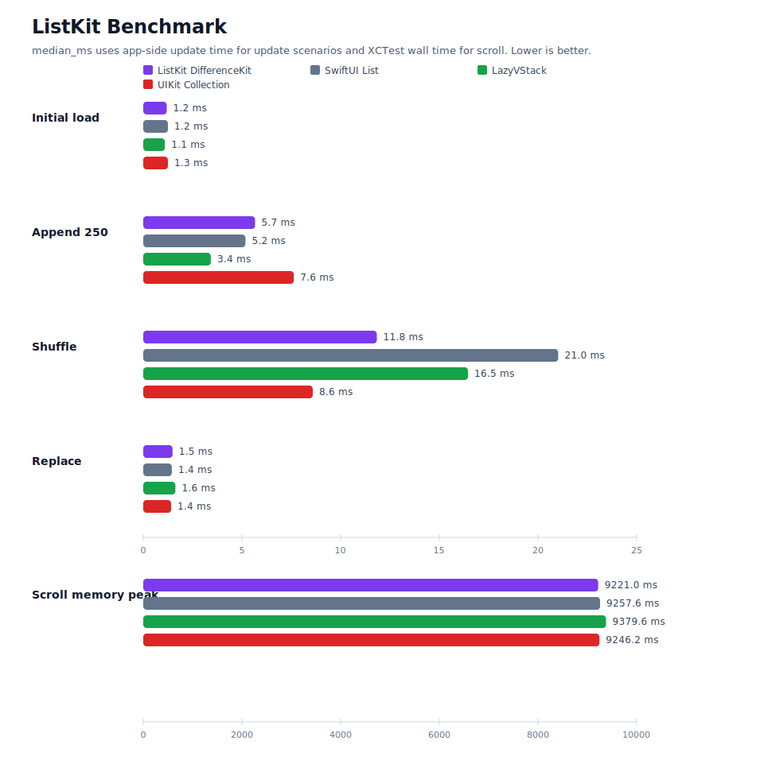

# ListKit

[English](./README.md) | [한국어](./README.ko.md)

`ListKit`은 SwiftUI 문법으로 선언하면서 내부는 `UICollectionView`로 렌더링하는 리스트 라이브러리입니다.

목표는 SwiftUI다운 리스트 작성 경험을 유지하면서도, SwiftUI `List`가 직접 노출하지 않는 collection view delegate 생명주기와 업데이트 전략을 선택적으로 사용할 수 있게 하는 것입니다.

## 목차

- [빠른 시작](#빠른-시작)
- [현재 상태](#현재-상태)
- [요구 사항](#요구-사항)
- [설치](#설치)
- [테스트](#테스트)
- [SwiftUI List와의 차이](#swiftui-list와의-차이)
- [AnyView 없는 SwiftUI Hosting](#anyview-없는-swiftui-hosting)
- [주요 API](#주요-api)
- [Identity와 Equality](#identity와-equality)
- [Update Engine](#update-engine)
- [Section Layout](#section-layout)
- [프로그래밍 방식 스크롤](#프로그래밍-방식-스크롤)
- [Refresh와 Search](#refresh와-search)
- [Context Menu](#context-menu)
- [Swipe Actions](#swipe-actions)
- [성능 디버깅](#성능-디버깅)
- [벤치마크](#벤치마크)
- [SwiftUI List에서 이전하기](#swiftui-list에서-이전하기)
- [샘플 앱 예제](#샘플-앱-예제)

## 빠른 시작

첫 예제는 [BasicListExample](./Examples/SampleApp/SampleApp/View/BasicListExample.swift)과 같은 흐름입니다.

```swift
import SwiftUI
import ListKit

struct Message: Identifiable, Hashable {
    let id: Int
    var title: String
    var subtitle: String
}

struct MessageRow: View {
    let message: Message

    var body: some View {
        VStack(alignment: .leading, spacing: 4) {
            Text(message.title)
                .font(.headline)
            Text(message.subtitle)
                .font(.subheadline)
                .foregroundStyle(.secondary)
        }
        .padding(.vertical, 8)
    }
}

struct InboxView: View {
    let messages: [Message]

    var body: some View {
        LKList(messages, id: \.id) { message in
            MessageRow(message: message)
        }
        .onSelect { context in
            print("Selected", context.id)
        }
        .refreshable {
            await reload()
        }
        .listKitStyle(.plain)
    }

    private func reload() async {}
}
```

미리보기 가능한 예제는 [Examples/ListKitExamples](./Examples/ListKitExamples/ListKitExamples.swift)에 있고, 실행 가능한 샘플 앱은 [Examples/SampleApp](./Examples/SampleApp)에 있습니다. 샘플 앱의 각 화면은 [Examples/SampleApp/SampleApp/View](./Examples/SampleApp/SampleApp/View)에 파일별로 분리되어 있습니다.

## 현재 상태

구현 진행 상황은 [AGENTS.md](./AGENTS.md)에 기록되어 있습니다. 현재 milestone은 Swift Package 기반 라이브러리, public `LK` namespace, UIKit bridge, 주요 delegate hook, update engine 예제를 포함합니다.

## 요구 사항

- Swift 6.1
- iOS 16.0+
- Swift Package Manager
- `.differenceKit` update engine을 위해 DifferenceKit 1.3.0을 직접 의존성으로 사용합니다.

## 설치

Swift Package Manager 의존성에 ListKit을 추가합니다.

```swift
dependencies: [
    .package(url: "https://github.com/indextrown/Listkit.git", from: "1.0.0")
]
```

그리고 앱 target에 product를 연결합니다.

```swift
.target(
    name: "YourApp",
    dependencies: [
        .product(name: "ListKit", package: "Listkit")
    ]
)
```

Xcode에서는 **File > Add Package Dependencies...**를 열고 `https://github.com/indextrown/Listkit.git`를 입력하면 됩니다.

## 테스트

```sh
swift test
```

UIKit 동작은 iOS 시뮬레이터 테스트로 확인합니다.

```sh
xcodebuild test -scheme ListKit -destination 'platform=iOS Simulator,name=iPhone 15 Pro Max,OS=26.0'
```

샘플 앱 빌드는 다음 명령으로 확인할 수 있습니다.

```sh
xcodebuild -project Examples/SampleApp/SampleApp.xcodeproj -scheme SampleApp -destination 'generic/platform=iOS Simulator' build
```

## SwiftUI List와의 차이

`ListKit`은 SwiftUI 선언 방식을 유지하지만 렌더링은 `UICollectionView`를 사용합니다.

| 영역 | SwiftUI `List` | `ListKit` |
| --- | --- | --- |
| Row content | SwiftUI `View` | collection view cell에 hosted된 SwiftUI `View` |
| Delegate lifecycle | 대부분 숨겨짐 | selection, highlight, display, scroll, prefetch, context menu, focus 등 노출 |
| Update strategy | 시스템이 제어 | `.reloadData`, `.diffableDataSource`, `.differenceKit` 선택 |
| Layout | SwiftUI list style | compositional layout 기반 list/grid |
| UIKit escape hatch | 제한적 | 필요한 경우 UIKit 타입 기반 advanced hook 제공 |

기본 시스템 동작만 필요하면 SwiftUI `List`가 더 단순합니다. collection view delegate timing, update engine 선택, collection layout 제어가 필요하면 `ListKit`을 사용합니다.

## AnyView 없는 SwiftUI Hosting

ListKit은 row, header, footer content를 저장할 때 사용자 view를 `AnyView`로 감싸지 않습니다. 초기 prototype은 heterogeneous SwiftUI row type을 하나의 list model에 담기 위해 `() -> AnyView` factory를 사용했지만, 현재 구현은 view 자체가 아니라 hosting 작업을 타입 소거합니다.

기존 형태는 단순했지만, UIKit hosting으로 넘기기 전에 모든 row view를 먼저 지웠습니다.

```swift
// 초기 prototype 형태
struct LKItemModel {
    let makeContent: @MainActor () -> AnyView
}

LKItemModel {
    AnyView(MessageRow(message: message))
}
```

현재 형태는 사용자가 만든 concrete SwiftUI view를 generic box 안에 보관합니다.

```swift
struct LKAnyViewContent {
    private let box: any LKAnyViewContentBox

    init<Content: View>(@ViewBuilder _ makeContent: @escaping @MainActor () -> Content) {
        self.box = LKViewContentBox(makeContent: makeContent)
    }
}

private struct LKViewContentBox<Content: View>: LKAnyViewContentBox {
    let makeContent: @MainActor () -> Content
}
```

내부의 `LKAnyViewContent`는 concrete `Content: View` factory를 작은 generic box에 보관합니다. cell 또는 supplementary view가 렌더링될 때 이 box가 직접 `UIHostingConfiguration`을 만들고, selection state, index path, section ID, item ID 같은 ListKit environment 값을 주입합니다.

```swift
UIHostingConfiguration {
    makeContent()
        .environment(\.lkCellState, state)
        .environment(\.listKitIndexPath, indexPath)
        .environment(\.listKitSectionID, sectionID)
        .environment(\.listKitItemID, itemID)
}
```

public API는 그대로 `@ViewBuilder` row content를 받지만, ListKit 기본 렌더링 경로에서는 추가 `AnyView` wrapper를 만들지 않습니다. 이 선택은 모든 화면의 성능 향상을 보장한다는 뜻은 아닙니다. 실제 비용은 row body와 SwiftUI hosting 비용에 크게 좌우됩니다.

## 주요 API

일반적인 UIKit delegate surface는 SwiftUI modifier로 제공합니다.

| 기능 | ListKit API |
| --- | --- |
| 선택 | `.onShouldSelect`, `.onSelect`, `.selection`, `.selectionMode` |
| 하이라이트 | `.onShouldHighlight`, `.onHighlight`, `.onUnhighlight` |
| 표시 생명주기 | `.onWillDisplay`, `.onDidEndDisplaying` |
| supplementary 표시 생명주기 | `.onWillDisplayHeader`, `.onDidEndDisplayingHeader`, `.onWillDisplayFooter`, `.onDidEndDisplayingFooter` |
| prefetch | `.onPrefetch`, `.onCancelPrefetch` |
| primary action | `.onCanPerformPrimaryAction`, `.onPrimaryAction` |
| context menu advanced hook | `.uiContextMenuConfiguration`, `.onPreviewCommit`, `.previewForHighlightingContextMenu`, `.previewForDismissingContextMenu` |
| swipe actions | `.swipeActions(edge:allowsFullSwipe:actions:)` |
| scroll | `.onScroll`, `.onWillBeginDragging`, `.onDidEndDragging`, `.onReachEnd` |

row-level handler가 section-level handler보다 우선하고, section-level handler가 list-level handler보다 우선합니다.

## Identity와 Equality

모든 section과 row는 stable identity가 필요합니다.

```swift
LKList(messages, id: \.id) { message in
    MessageRow(message: message)
}
```

builder DSL에서는 `LKSection(id:)`, `LKRow(_:id:)`로 identity를 제공합니다.

```swift
LKList {
    LKSection(id: "inbox") {
        for message in messages {
            LKRow(message, id: \.id) {
                MessageRow(message: message)
            }
            .equatableToken(message.updatedAt)
        }
    }
}
```

identity는 “같은 항목인가”를 판단하고, equality token은 “렌더링 내용이 바뀌었는가”를 판단합니다. SwiftUI view 값 자체는 비교하지 않습니다.

## Update Engine

ListKit은 기본으로 `.differenceKit`을 사용합니다. 필요하면 리스트별로 다른 업데이트 엔진을 고를 수 있습니다.

```swift
LKList(messages, id: \.id) { message in
    MessageRow(message: message)
}
.updateEngine(.diffableDataSource)
```

| Engine | 사용 시점 | 참고 |
| --- | --- | --- |
| `.reloadData` | 디버깅, 단순한 동작, 애니메이션이 중요하지 않은 화면 | 가장 단순하지만 세밀한 animation은 없습니다. |
| `.diffableDataSource` | Apple-native diffing이 필요한 화면 | stable section/item ID와 잘 맞습니다. |
| `.differenceKit` | 기본 staged changeset 엔진과 explicit content equality가 필요한 화면 | DifferenceKit 의존성이 필요합니다. |

diff 경로가 안전하게 업데이트를 적용할 수 없으면 ListKit은 더 안전한 reload 경로로 fallback할 수 있습니다.

## Section Layout

특정 section만 기본 list style과 다른 layout을 써야 하면 `LKSection`에 `.sectionLayout(...)`을 붙입니다.

```swift
LKSection(id: "featured") {
    for item in featuredItems {
        LKRow(item, id: \.id) {
            FeaturedRow(item: item)
        }
    }
} header: {
    Text("Featured")
}
.sectionLayout(.custom { sectionIndex, environment in
    makeFeaturedSection(sectionIndex: sectionIndex, environment: environment)
})
.pinnedHeader()
.headerBackground(.systemBackground)
```

`.list`, `.grid`, `.custom` layout 모두에서 `.pinnedHeader()`는 header boundary supplementary item의 `pinToVisibleBounds`에 반영됩니다. `.custom`에서는 provider가 만든 header의 size, alignment, contentInsets는 유지하고 header boundary item의 `pinToVisibleBounds`만 바꿉니다. footer boundary item에는 `.pinnedHeader()`를 적용하지 않습니다.

custom layout helper를 함수로 분리할 때는 `LKCustomSectionLayoutProvider`를 반환해서 `.custom(...)`에 전달하면 됩니다.

pinned header 뒤로 아래 content가 비치면 `.headerBackground(...)`를 함께 사용합니다. 이 색상은 SwiftUI header content뿐 아니라 collection reusable view, hosted root view, collection view 폭을 덮는 full-bleed background layer에도 적용됩니다. header content 정렬은 기존 layout frame 기준을 유지합니다.

## 프로그래밍 방식 스크롤

SwiftUI 부모 view에서 list 스크롤을 제어해야 하면 UIKit view tree를 직접 탐색하지 말고 `LKListProxy`를 사용합니다.

```swift
@State private var listProxy = LKListProxy()

LKList(messages, id: \.id) { message in
    MessageRow(message: message)
}
.listProxy(listProxy)

Button("Top") {
    listProxy.scrollToTop(animated: true)
}
```

`scrollToTop(animated:)`은 collection view의 `adjustedContentInset.top`을 고려해 실제 보이는 최상단으로 이동합니다. 같은 proxy로 `scrollToOffset(_:animated:)`, `scrollToItem(id:sectionID:position:animated:)`, `scrollToSection(id:position:animated:)`도 사용할 수 있습니다.

## Refresh와 Search

ListKit은 collection view 기반 refresh control을 제공합니다.

```swift
LKList(messages, id: \.id) { message in
    MessageRow(message: message)
}
.refreshable {
    await reload()
}
```

검색은 SwiftUI `.searchable`과 조합합니다.

```swift
@State private var query = ""

LKList(filteredMessages, id: \.id) { message in
    MessageRow(message: message)
}
.searchable(text: $query)
```

필터링은 view model이나 computed state에서 처리한 뒤 필터링된 collection을 `LKList`에 전달합니다.

## Context Menu

단순 메뉴는 row content 안에서 SwiftUI `.contextMenu`를 그대로 사용합니다.

```swift
LKList(messages, id: \.id) { message in
    MessageRow(message: message)
        .contextMenu {
            Button("Archive") {
                archive(message.id)
            }
        }
}
```

UIKit preview controller, targeted preview, commit animator가 필요하면 ListKit의 advanced context menu hook을 사용합니다.

## Swipe Actions

row, section, list 레벨에 `LKSwipeAction` 기반 swipe action을 붙일 수 있습니다. 우선순위는 row, section, list 순서입니다.

```swift
LKList(messages, id: \.id) { message in
    MessageRow(message: message)
}
.swipeActions(edge: .trailing, allowsFullSwipe: false) { context in
    [
        LKSwipeAction(style: .destructive, title: "Delete") { context, completion in
            delete(context.id)
            completion(true)
        },
        LKSwipeAction(title: "Archive", backgroundColor: .systemBlue) { context, completion in
            archive(context.id)
            completion(true)
        },
    ]
}
```

내부 구현은 UIKit `UISwipeActionsConfiguration`을 사용하므로 collection view list row의 시스템 swipe 동작을 따릅니다.

## 성능 디버깅

- stable ID를 사용하세요. ID가 바뀌면 in-place update가 아니라 remove/insert로 처리됩니다.
- content나 size가 바뀌는 상태에는 `.equatableToken(...)`을 붙이세요.
- 이미지/비디오 작업은 `.onWillDisplay`에서 시작하고 `.onDidEndDisplaying`에서 정리하세요.
- 대부분의 animated update는 기본값인 `.differenceKit`을 사용하세요.
- diffing 문제를 분리하려면 `.reloadData`로 바꿔 확인하세요.
- invalid lookup, unsupported layout, diff fallback을 추적할 때는 `.listKitDiagnostics(.enabled)`를 켜세요.

## 벤치마크

[Examples/BenchmarkApp](./Examples/BenchmarkApp) 벤치마크 프로젝트는 같은 row model을 `ListKit`, SwiftUI `List`, `ScrollView + LazyVStack`으로 렌더링해서 비교합니다.



현재 저장소에 포함된 그래프는 [Benchmarks/results/sample-results.csv](./Benchmarks/results/sample-results.csv)에서 생성한 샘플 데이터입니다. 문서와 그래프 생성 흐름을 보여주기 위한 값이며, 공식 성능 수치로 보지 않아야 합니다.

벤치마크 앱 빌드:

```sh
xcodebuild \
  -project Examples/BenchmarkApp/BenchmarkApp.xcodeproj \
  -scheme BenchmarkApp \
  -destination 'generic/platform=iOS Simulator' \
  build
```

의미 있는 수치를 얻으려면 같은 물리 기기에서 Release build로 실행하고, row count와 scenario를 고정한 뒤 각 구현을 여러 번 측정해서 median 값을 기록하세요. CSV를 실제 측정값으로 교체한 뒤 그래프를 다시 생성합니다.

```sh
python3 Benchmarks/scripts/render_chart.py \
  Benchmarks/results/sample-results.csv \
  Benchmarks/results/listkit-benchmark-sample.svg
```

자세한 흐름은 [Benchmarks/README.md](./Benchmarks/README.md)에 정리되어 있습니다.

## SwiftUI List에서 이전하기

기존 SwiftUI `List`:

```swift
List(messages) { message in
    MessageRow(message: message)
}
```

ListKit:

```swift
LKList(messages, id: \.id) { message in
    MessageRow(message: message)
}
```

| SwiftUI List 개념 | ListKit 대응 |
| --- | --- |
| `List(data) { row }` | `LKList(data, id: \.id) { row }` |
| `Section` | `LKSection(id:)`와 header/footer builder |
| `.refreshable` | `LKList`의 `.refreshable` |
| `.searchable` | SwiftUI `.searchable`을 `LKList`에 조합 |
| `.onDelete`, `.onMove` | source data를 변경하고 update engine이 새 model을 반영 |
| row `.contextMenu` | row content 안에 SwiftUI `.contextMenu` 유지 |
| UIKit context menu preview | ListKit advanced context menu hook 사용 |
| list style | `.listKitStyle(...)` 또는 section `.sectionLayout(...)` |

기본 migration이 컴파일되면 화면 요구에 맞춰 update engine, selection binding, delegate hook을 하나씩 추가하세요.

## 샘플 앱 예제

샘플 앱은 ListKit의 주요 동작을 화면별로 확인할 수 있는 작은 갤러리입니다.

| 화면 | 파일 | 설명 |
| --- | --- | --- |
| Basic List | [BasicListExample.swift](./Examples/SampleApp/SampleApp/View/BasicListExample.swift) | plain 리스트, 선택, display lifecycle, pull to refresh, diffable update engine을 함께 보여줍니다. |
| Sections | [SectionedHeaderFooterExample.swift](./Examples/SampleApp/SampleApp/View/SectionedHeaderFooterExample.swift) | builder DSL로 section, header, footer를 구성합니다. |
| Selection | [SelectionExample.swift](./Examples/SampleApp/SampleApp/View/SelectionExample.swift) | 다중 선택과 archived row 선택 차단 규칙을 보여줍니다. |
| Refresh | [RefreshExample.swift](./Examples/SampleApp/SampleApp/View/RefreshExample.swift) | `UIRefreshControl` 기반 refresh 후 새 row를 삽입합니다. |
| Search | [SearchExample.swift](./Examples/SampleApp/SampleApp/View/SearchExample.swift) | SwiftUI `.searchable`과 필터링된 `LKList` 조합을 보여줍니다. |
| Display Lifecycle | [DisplayLifecycleExample.swift](./Examples/SampleApp/SampleApp/View/DisplayLifecycleExample.swift) | `willDisplay`, `didEndDisplaying`으로 row 작업 시작/정지를 라우팅합니다. |
| Prefetch | [PrefetchExample.swift](./Examples/SampleApp/SampleApp/View/PrefetchExample.swift) | `onReachEnd`로 끝에 도달하기 전에 다음 페이지를 append하는 infinite scroll 예제입니다. |
| Image Prefetch | [ImagePrefetchExample.swift](./Examples/SampleApp/SampleApp/View/ImagePrefetchExample.swift) | `.onPrefetch`, `.onCancelPrefetch` collection view callback으로 이미지 로딩 캐시를 제어합니다. |
| Context Menu | [ContextMenuExample.swift](./Examples/SampleApp/SampleApp/View/ContextMenuExample.swift) | row content 안에서 SwiftUI context menu를 사용합니다. |
| Grid Layout | [GridLayoutExample.swift](./Examples/SampleApp/SampleApp/View/GridLayoutExample.swift) | section 단위 `.sectionLayout(.grid(...))` 레이아웃을 보여줍니다. |
| Diffable Engine | [DiffableEngineExample.swift](./Examples/SampleApp/SampleApp/View/DiffableEngineExample.swift) | Apple `UICollectionViewDiffableDataSource` 업데이트 엔진을 사용합니다. |
| DifferenceKit Engine | [DifferenceKitEngineExample.swift](./Examples/SampleApp/SampleApp/View/DifferenceKitEngineExample.swift) | DifferenceKit staged update 엔진을 사용합니다. |
| Shuffle Diffable | [ShuffleDiffableExample.swift](./Examples/SampleApp/SampleApp/View/ShuffleDiffableExample.swift) | 우측 상단 shuffle 버튼으로 diffable engine에서 row 이동을 확인합니다. |
| Shuffle DifferenceKit | [ShuffleDifferenceKitExample.swift](./Examples/SampleApp/SampleApp/View/ShuffleDifferenceKitExample.swift) | 우측 상단 shuffle 버튼으로 DifferenceKit engine에서 row 이동을 확인합니다. |
| Large Data | [LargeDataExample.swift](./Examples/SampleApp/SampleApp/View/LargeDataExample.swift) | 1,000개 row를 가진 큰 snapshot 업데이트를 확인합니다. |
