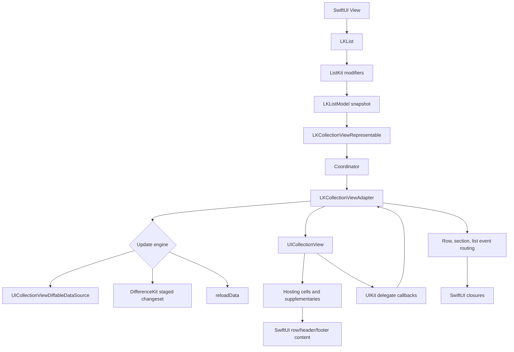
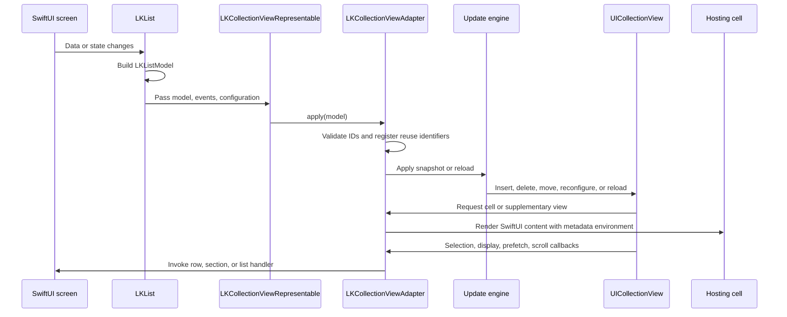

# ListKit

[English](./README.md) | [한국어](./README.ko.md)

`ListKit` is a SwiftUI-facing list library backed by `UICollectionView`.

The project goal is to keep SwiftUI-style list declaration while exposing the collection view delegate surface that SwiftUI `List` does not provide directly.

## Table of Contents

- [Quick Start](#quick-start)
- [Current Status](#current-status)
- [Requirements](#requirements)
- [Installation](#installation)
- [Test](#test)
- [Release Status](#release-status)
- [How ListKit Differs From SwiftUI List](#how-listkit-differs-from-swiftui-list)
- [SwiftUI Hosting Without AnyView](#swiftui-hosting-without-anyview)
- [Delegate Hooks](#delegate-hooks)
- [Identity And Equality](#identity-and-equality)
- [Update Engines](#update-engines)
- [Section Layouts](#section-layouts)
- [Selection And Primary Action](#selection-and-primary-action)
- [Dynamic Height And Self-Sizing](#dynamic-height-and-self-sizing)
- [Programmatic Scrolling](#programmatic-scrolling)
- [Refresh And Search](#refresh-and-search)
- [Context Menus](#context-menus)
- [Swipe Actions](#swipe-actions)
- [Diagnostics](#diagnostics)
- [Performance Troubleshooting](#performance-troubleshooting)
- [Benchmarks](#benchmarks)
- [Migrating From SwiftUI List](#migrating-from-swiftui-list)
- [Sample App Examples](#sample-app-examples)

## Quick Start

The first example is kept in sync with [BasicListExample](./Examples/ListKitExamples/ListKitExamples.swift):

```swift
import SwiftUI
import ListKit

struct Message: Identifiable, Hashable {
    let id: Int
    var title: String
    var subtitle: String
}

struct MessageRow: View {
    let message: Message

    var body: some View {
        VStack(alignment: .leading, spacing: 4) {
            Text(message.title)
                .font(.headline)
            Text(message.subtitle)
                .font(.subheadline)
                .foregroundStyle(.secondary)
        }
        .padding(.vertical, 8)
    }
}

enum ImagePipeline {
    static func resume(for id: AnyHashable) {}
    static func pause(for id: AnyHashable) {}
}

struct InboxView: View {
    let messages: [Message]

    var body: some View {
        LKList(messages, id: \.id) { message in
            MessageRow(message: message)
        }
        .onSelect { context in
            print("Selected", context.id)
        }
        .onWillDisplay { context in
            ImagePipeline.resume(for: context.id)
        }
        .onDidEndDisplaying { context in
            ImagePipeline.pause(for: context.id)
        }
        .refreshable {
            await reload()
        }
        .listKitStyle(.plain)
    }

    private func reload() async {}
}
```

Additional previewable examples live in [Examples/ListKitExamples](./Examples/ListKitExamples/ListKitExamples.swift). The runnable sample app lives in [Examples/SampleApp](./Examples/SampleApp), with each screen split under [Examples/SampleApp/SampleApp/View](./Examples/SampleApp/SampleApp/View).

## Current Status

Implementation is tracked in [AGENTS.md](./AGENTS.md). The first milestone establishes the package baseline, public `LK` namespace direction, and test command.

## Requirements

- Swift 6.1
- iOS 16.0+
- Swift Package Manager
- DifferenceKit 1.3.0 is currently a direct package dependency for the `.differenceKit` update engine.

## Installation

Add ListKit to your Swift Package Manager dependencies:

```swift
dependencies: [
    .package(url: "https://github.com/indextrown/Listkit.git", from: "1.0.0")
]
```

Then add the product to your target:

```swift
.target(
    name: "YourApp",
    dependencies: [
        .product(name: "ListKit", package: "Listkit")
    ]
)
```

In Xcode, use **File > Add Package Dependencies...** and enter `https://github.com/indextrown/Listkit.git`.

## Test

```sh
swift test
```

For UIKit behavior, run the iOS simulator test suite:

```sh
xcodebuild test -scheme ListKit -destination 'platform=iOS Simulator,name=iPhone 15 Pro Max,OS=26.0'
```

## Release Status

- Product: one SwiftPM library product, `ListKit`.
- Versioning: semantic versioning starts with the first tag; the draft first release is tracked in [CHANGELOG.md](./CHANGELOG.md).
- License: ListKit is released under the [MIT License](./LICENSE).
- Third-party notices: [THIRD_PARTY_NOTICES.md](./THIRD_PARTY_NOTICES.md) records the current DifferenceKit attribution.
- DifferenceKit: the dependency is intentionally visible in `Package.swift` for this milestone. Splitting it into an optional product is a pre-1.0 compatibility item.
- Availability: the package declares iOS 16, macCatalyst 16, tvOS 16, and macOS 10.15. UIKit-backed runtime behavior is compiled behind UIKit and SwiftUI availability checks.

## How ListKit Differs From SwiftUI List

`ListKit` keeps the SwiftUI declaration style but renders through `UICollectionView`.

| Area | SwiftUI `List` | `ListKit` |
| --- | --- | --- |
| Row content | SwiftUI `View` | SwiftUI `View` hosted in collection view cells |
| Delegate lifecycle | Mostly hidden | Selection, highlight, display, scroll, prefetch, context menu, focus, menu, and spring loading hooks |
| Update strategy | System controlled | `.reloadData`, `.diffableDataSource`, or `.differenceKit` |
| Layout | SwiftUI list styles | `UICollectionViewCompositionalLayout` backed list and grid layouts |
| Escape hatch | Limited UIKit control | UIKit typed advanced hooks where needed |

Use SwiftUI `List` when system behavior is enough. Use `ListKit` when the screen needs collection view delegate timing, custom update strategy, or collection layout control while keeping SwiftUI row views.

## SwiftUI Hosting Without AnyView

ListKit stores row, header, and footer content without wrapping user views in `AnyView`. Earlier prototypes used a `() -> AnyView` factory because the list model has to keep heterogeneous SwiftUI row types in one collection. The current implementation type-erases the hosting operation instead.

The old shape was simple, but it erased every row view before UIKit hosting:

```swift
// Earlier prototype shape
struct LKItemModel {
    let makeContent: @MainActor () -> AnyView
}

LKItemModel {
    AnyView(MessageRow(message: message))
}
```

The current shape keeps the user's concrete SwiftUI view inside a generic box:

```swift
struct LKAnyViewContent {
    private let box: any LKAnyViewContentBox

    init<Content: View>(@ViewBuilder _ makeContent: @escaping @MainActor () -> Content) {
        self.box = LKViewContentBox(makeContent: makeContent)
    }
}

private struct LKViewContentBox<Content: View>: LKAnyViewContentBox {
    let makeContent: @MainActor () -> Content
}
```

Internally, `LKAnyViewContent` keeps a small box around the concrete `Content: View` factory. When a cell or supplementary view renders, that box builds the `UIHostingConfiguration` directly and injects ListKit environment values such as selection state, index path, section ID, and item ID.

```swift
UIHostingConfiguration {
    makeContent()
        .environment(\.lkCellState, state)
        .environment(\.listKitIndexPath, indexPath)
        .environment(\.listKitSectionID, sectionID)
        .environment(\.listKitItemID, itemID)
}
```

The public API still accepts ordinary `@ViewBuilder` row content, while SwiftUI does not receive an extra `AnyView` wrapper from ListKit's default rendering path. This is an implementation choice, not a guarantee that every screen will be faster; row body cost and SwiftUI hosting cost can still dominate.

## Delegate Hooks

Common hooks are exposed as typed SwiftUI modifiers:

| UIKit delegate surface | ListKit API |
| --- | --- |
| `shouldSelectItemAt`, `didSelectItemAt` | `.onShouldSelect`, `.onSelect`, `.selection`, `.selectionMode` |
| `shouldDeselectItemAt`, `didDeselectItemAt` | `.onShouldDeselect`, `.onDeselect` |
| `shouldHighlightItemAt`, `didHighlightItemAt`, `didUnhighlightItemAt` | `.onShouldHighlight`, `.onHighlight`, `.onUnhighlight` |
| `willDisplay`, `didEndDisplaying` | `.onWillDisplay`, `.onDidEndDisplaying` |
| supplementary display lifecycle | `.onWillDisplayHeader`, `.onDidEndDisplayingHeader`, `.onWillDisplayFooter`, `.onDidEndDisplayingFooter` |
| `UICollectionViewDataSourcePrefetching` | `.onPrefetch`, `.onCancelPrefetch` |
| primary action | `.onCanPerformPrimaryAction`, `.onPrimaryAction` |
| multiple selection interaction | `.onShouldBeginMultipleSelectionInteraction`, `.onBeginMultipleSelectionInteraction`, `.onEndMultipleSelectionInteraction` |
| context menu delegate | `.uiContextMenuConfiguration`, `.onPreviewCommit`, `.previewForHighlightingContextMenu`, `.previewForDismissingContextMenu` |
| swipe actions | `.swipeActions(edge:allowsFullSwipe:actions:)` |
| focus delegate | `.onCanFocus`, `.onShouldUpdateFocus`, `.onDidUpdateFocus`, `.preferredFocusedItem` |
| legacy edit menu actions | `.onShouldShowEditMenu`, `.onCanPerformMenuAction`, `.onPerformMenuAction` |
| spring loading | `.onShouldSpringLoad` |
| scroll view delegate | `.onScroll`, `.onWillBeginDragging`, `.onWillEndDragging`, `.onDidEndDragging`, `.onWillBeginDecelerating`, `.onDidEndDecelerating`, `.onShouldScrollToTop`, `.onDidScrollToTop`, `.onReachEnd` |

Row-level handlers override section-level handlers, and section-level handlers override list-level handlers for the same event.

## Identity And Equality

Every section and row needs a stable identity. For data-driven lists, pass an `id` key path:

```swift
LKList(messages, id: \.id) { message in
    MessageRow(message: message)
}
```

For builder lists, `LKSection(id:)` and `LKRow(_:id:)` provide those identities explicitly:

```swift
LKList {
    LKSection(id: "inbox") {
        for message in messages {
            LKRow(message, id: \.id) {
                MessageRow(message: message)
            }
            .equatableToken(message.updatedAt)
        }
    }
}
```

Identity answers “is this the same item?” Equality tokens answer “did the rendered content change?” ListKit does not compare SwiftUI view values. If content can change while identity remains the same, provide `.equatableToken(...)` so update engines can reload or reconfigure the row deliberately.

Avoid storing `IndexPath` for later asynchronous use. Delegate contexts include `id`, `item`, `indexPath`, and `sectionID`; use stable IDs for long-running work.

## Update Engines

ListKit uses `.differenceKit` by default. Choose another update engine per list when needed:

```swift
LKList(messages, id: \.id) { message in
    MessageRow(message: message)
}
.updateEngine(.diffableDataSource)
```

| Engine | Use when | Notes |
| --- | --- | --- |
| `.reloadData` | Debugging, simplest behavior, or when animation is unnecessary | Least sensitive to identity mistakes, but no fine-grained animations |
| `.diffableDataSource` | You need Apple-native diffing | Good fit for stable section and item IDs; content-only changes use reload/reconfigure policy |
| `.differenceKit` | Default staged changeset engine with explicit content equality | Uses DifferenceKit and relies on stable identity plus useful equality tokens |

If a diff path cannot safely apply an update, ListKit falls back to a safer reload path and can emit a diagnostics warning when diagnostics are enabled.

## Section Layouts

Use `.sectionLayout(...)` on `LKSection` when one section needs a layout different from the list default.

```swift
LKSection(id: "featured") {
    for item in featuredItems {
        LKRow(item, id: \.id) {
            FeaturedRow(item: item)
        }
    }
} header: {
    Text("Featured")
}
.sectionLayout(.custom { sectionIndex, environment in
    makeFeaturedSection(sectionIndex: sectionIndex, environment: environment)
})
.pinnedHeader()
.headerBackground(.systemBackground)
```

For `.list`, `.grid`, and `.custom` layouts, `.pinnedHeader()` maps to the header boundary supplementary item's `pinToVisibleBounds`. With `.custom`, ListKit preserves the provider's header size, alignment, and content insets, and only updates `pinToVisibleBounds` for header boundary items. Footer boundary items are not pinned by `.pinnedHeader()`.

When extracting a custom layout helper, return `LKCustomSectionLayoutProvider` and pass it to `.custom(...)`.

Use `.headerBackground(...)` with pinned headers when the supplementary container should cover content scrolling underneath it. The color is applied to the collection reusable view and the hosted root view, not only to the SwiftUI header content.

## Selection And Primary Action

Selection is state. Primary action is intent.

Use selection APIs when the UI should remember selected rows:

```swift
@State private var selection = Set<Message.ID>()

LKList(messages, id: \.id) { message in
    MessageRow(message: message)
}
.selection($selection)
.selectionMode(.multiple)
.onShouldSelect { context in
    guard let message = context.item as? Message else { return true }
    return !message.isArchived
}
```

Use primary action when activation should perform work without being treated as selection state. Keyboard, pointer, remote, or accessibility activation can route through primary action:

```swift
LKList(messages, id: \.id) { message in
    MessageRow(message: message)
}
.onCanPerformPrimaryAction { _ in true }
.onPrimaryAction { context in
    openMessage(id: context.id)
}
```

## Dynamic Height And Self-Sizing

Rows are hosted SwiftUI views. Prefer normal SwiftUI layout that can produce an intrinsic height, and avoid hard-coded collection view cell heights unless the layout really needs them. ListKit records preferred fitting sizes from hosted cells and supplementary views so later layout invalidation can reuse measured size context.

For large dynamic rows:

- Keep row identity stable while the row expands or collapses.
- Provide an equality token for state that changes row size.
- Prefer estimated list layouts over fixed-size grid cells when text can wrap.
- Keep expensive image work behind display lifecycle or prefetch hooks.

## Programmatic Scrolling

Use `LKListProxy` when the parent SwiftUI view needs to control list scrolling without reaching into the UIKit view tree.

```swift
@State private var listProxy = LKListProxy()

LKList(messages, id: \.id) { message in
    MessageRow(message: message)
}
.listProxy(listProxy)

Button("Top") {
    listProxy.scrollToTop(animated: true)
}
```

`scrollToTop(animated:)` uses the collection view's `adjustedContentInset.top` so the target is the actual visible top. The same proxy also supports `scrollToOffset(_:animated:)`, `scrollToItem(id:sectionID:position:animated:)`, and `scrollToSection(id:position:animated:)` for more specific targets.

## Refresh And Search

ListKit provides a collection-view-backed refresh control:

```swift
LKList(messages, id: \.id) { message in
    MessageRow(message: message)
}
.refreshable {
    await reload()
}
```

Search composes with SwiftUI's native `.searchable`:

```swift
@State private var query = ""

LKList(filteredMessages, id: \.id) { message in
    MessageRow(message: message)
}
.searchable(text: $query)
```

Keep filtering in your view model or computed state, then pass the filtered collection into `LKList`.

## Context Menus

Use SwiftUI's native `.contextMenu` inside row content for simple menus:

```swift
LKList(messages, id: \.id) { message in
    MessageRow(message: message)
        .contextMenu {
            Button("Archive") {
                archive(message.id)
            }
        }
}
```

Use ListKit's advanced UIKit hooks when the collection view delegate surface is required, such as preview controllers, targeted previews, or preview commit animation:

```swift
LKList(messages, id: \.id) { message in
    MessageRow(message: message)
}
.uiContextMenuConfiguration { context, point in
    UIContextMenuConfiguration(identifier: "\(context.id)" as NSString) {
        MessagePreviewController(id: context.id)
    }
}
.onPreviewCommit { configuration, animator in
    // Handle UIKit preview commit animation.
}
```

## Swipe Actions

Add row, section, or list-level swipe actions with `LKSwipeAction`. Row-level handlers override section-level handlers, and section-level handlers override list-level handlers.

```swift
LKList(messages, id: \.id) { message in
    MessageRow(message: message)
}
.swipeActions(edge: .trailing, allowsFullSwipe: false) { context in
    [
        LKSwipeAction(style: .destructive, title: "Delete") { context, completion in
            delete(context.id)
            completion(true)
        },
        LKSwipeAction(title: "Archive", backgroundColor: .systemBlue) { context, completion in
            archive(context.id)
            completion(true)
        },
    ]
}
```

Swipe actions use UIKit `UISwipeActionsConfiguration` under the hood, so they follow the system collection-view behavior for list rows.

## Diagnostics

Diagnostics are opt-in at runtime:

```swift
LKList(messages, id: \.id) { message in
    MessageRow(message: message)
}
.listKitDiagnostics(.enabled)
.onListKitWarning { warning in
    print("ListKit warning:", warning)
}
```

In debug builds, invalid model identity such as duplicate section or item IDs still triggers assertions early. Runtime diagnostics are for recoverable conditions and release fallback paths, including invalid lookups, unsupported layout values that ListKit can clamp, and diff update fallbacks.

## Performance Troubleshooting

- Use stable IDs. Changing IDs forces removal and insertion instead of an in-place update.
- Add `.equatableToken(...)` for content or size changes that should trigger reconfiguration.
- Start image or video work from `.onWillDisplay`, cancel or pause it from `.onDidEndDisplaying`, and use `.onPrefetch` for near-future work.
- Use the default `.differenceKit` for most animated updates; use `.reloadData` to isolate whether an issue is diffing-related.
- Enable `.listKitDiagnostics(.enabled)` while debugging invalid lookups, unsupported layout values, or diff fallbacks.
- Keep row bodies lightweight. Heavy work should live outside the SwiftUI row body and be keyed by item ID.

## Benchmarks

The benchmark project in [Examples/BenchmarkApp](./Examples/BenchmarkApp) compares the same row model rendered with `ListKit`, SwiftUI `List`, and `ScrollView + LazyVStack`.


The checked-in chart is generated from [Benchmarks/results/sample-results.csv](./Benchmarks/results/sample-results.csv). It is sample data for documenting the workflow, not a published performance claim.

Build the benchmark app:

```sh
xcodebuild \
  -project Examples/BenchmarkApp/BenchmarkApp.xcodeproj \
  -scheme BenchmarkApp \
  -destination 'generic/platform=iOS Simulator' \
  build
```

For meaningful numbers, run a Release build on the same physical device, use the same row count and scenario for every implementation, repeat each run, and record the median. After replacing the CSV with measured data, regenerate the chart:

```sh
python3 Benchmarks/scripts/render_chart.py \
  Benchmarks/results/sample-results.csv \
  Benchmarks/results/listkit-benchmark-sample.svg
```

See [Benchmarks/README.md](./Benchmarks/README.md) for the benchmark workflow.

## Migrating From SwiftUI List

Start with the same data shape:

```swift
List(messages) { message in
    MessageRow(message: message)
}
```

becomes:

```swift
LKList(messages, id: \.id) { message in
    MessageRow(message: message)
}
```

Then move behavior one concern at a time:

| SwiftUI List concept | ListKit equivalent |
| --- | --- |
| `List(data) { row }` | `LKList(data, id: \.id) { row }` |
| `Section` | `LKSection(id:)` with `header` and `footer` builders |
| `.refreshable` | `.refreshable` on `LKList` |
| `.searchable` | SwiftUI `.searchable` composed on `LKList` |
| `.onDelete`, `.onMove` | Update your source data and let the selected update engine apply the new model |
| simple row `.contextMenu` | Keep SwiftUI `.contextMenu` inside row content |
| UIKit-specific context menu previews | Use ListKit advanced context menu hooks |
| list style | `.listKitStyle(...)` or section `.sectionLayout(...)` |

After the basic migration compiles, choose an update engine, add selection binding if needed, and add delegate hooks only for the lifecycle events the screen actually uses.

## Sample App Examples

The sample app is a compact gallery of ListKit behaviors:

| Screen | File | What it shows |
| --- | --- | --- |
| Basic List | [BasicListExample.swift](./Examples/SampleApp/SampleApp/View/BasicListExample.swift) | A plain list with selection, display lifecycle hooks, pull to refresh, and the diffable update engine. |
| Sections | [SectionedHeaderFooterExample.swift](./Examples/SampleApp/SampleApp/View/SectionedHeaderFooterExample.swift) | Builder-style sections with header and footer content. |
| Selection | [SelectionExample.swift](./Examples/SampleApp/SampleApp/View/SelectionExample.swift) | Multiple selection and a `shouldSelect` rule that blocks archived rows. |
| Refresh | [RefreshExample.swift](./Examples/SampleApp/SampleApp/View/RefreshExample.swift) | `UIRefreshControl` integration that inserts a refreshed row after an async action. |
| Search | [SearchExample.swift](./Examples/SampleApp/SampleApp/View/SearchExample.swift) | SwiftUI `.searchable` composed with `LKList` and filtered source data. |
| Display Lifecycle | [DisplayLifecycleExample.swift](./Examples/SampleApp/SampleApp/View/DisplayLifecycleExample.swift) | `willDisplay` and `didEndDisplaying` callbacks for starting and pausing row work. |
| Prefetch | [PrefetchExample.swift](./Examples/SampleApp/SampleApp/View/PrefetchExample.swift) | Infinite scrolling with `onReachEnd`, appending the next page before the user reaches the end. |
| Image Prefetch | [ImagePrefetchExample.swift](./Examples/SampleApp/SampleApp/View/ImagePrefetchExample.swift) | Image loading cache driven by `.onPrefetch` and `.onCancelPrefetch` collection view callbacks. |
| Context Menu | [ContextMenuExample.swift](./Examples/SampleApp/SampleApp/View/ContextMenuExample.swift) | SwiftUI row-level context menus inside ListKit rows. |
| Grid Layout | [GridLayoutExample.swift](./Examples/SampleApp/SampleApp/View/GridLayoutExample.swift) | Section-level grid layout, cell spacing, and horizontal section scrolling using `.itemSpacing(...)` and `.scrollAxis(.horizontal)`. |
| Diffable Engine | [DiffableEngineExample.swift](./Examples/SampleApp/SampleApp/View/DiffableEngineExample.swift) | The Apple `UICollectionViewDiffableDataSource` update engine. |
| DifferenceKit Engine | [DifferenceKitEngineExample.swift](./Examples/SampleApp/SampleApp/View/DifferenceKitEngineExample.swift) | The DifferenceKit staged update engine. |
| Shuffle Diffable | [ShuffleDiffableExample.swift](./Examples/SampleApp/SampleApp/View/ShuffleDiffableExample.swift) | Toolbar-driven row shuffling with the diffable update engine. |
| Shuffle DifferenceKit | [ShuffleDifferenceKitExample.swift](./Examples/SampleApp/SampleApp/View/ShuffleDifferenceKitExample.swift) | Toolbar-driven row shuffling with the DifferenceKit update engine. |
| Large Data | [LargeDataExample.swift](./Examples/SampleApp/SampleApp/View/LargeDataExample.swift) | A 1,000-row list for larger snapshot updates. |

## Architecture



## Action Flow


